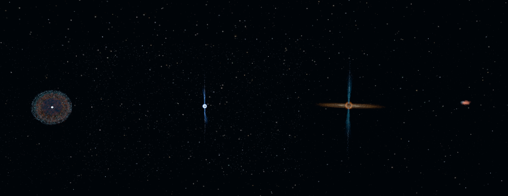
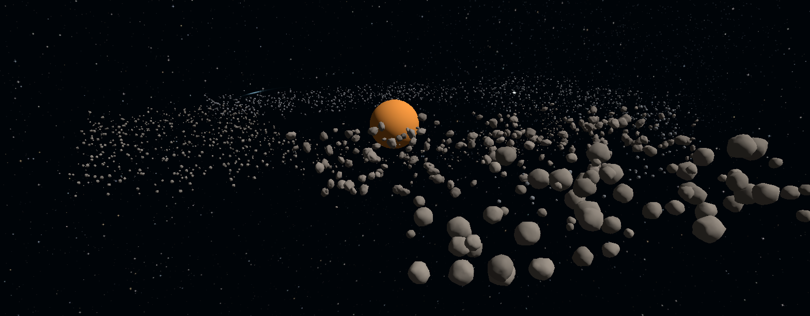
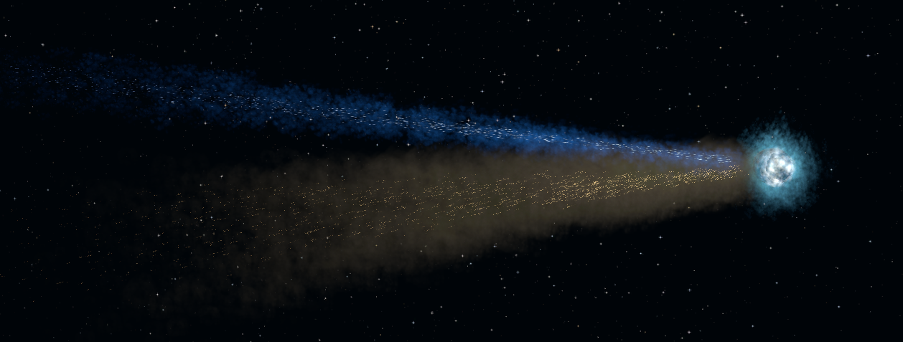
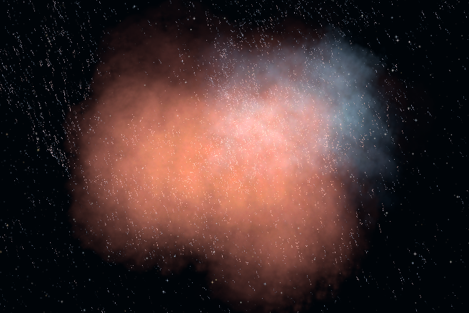
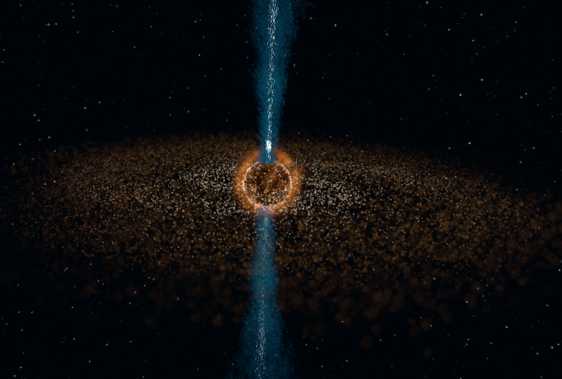
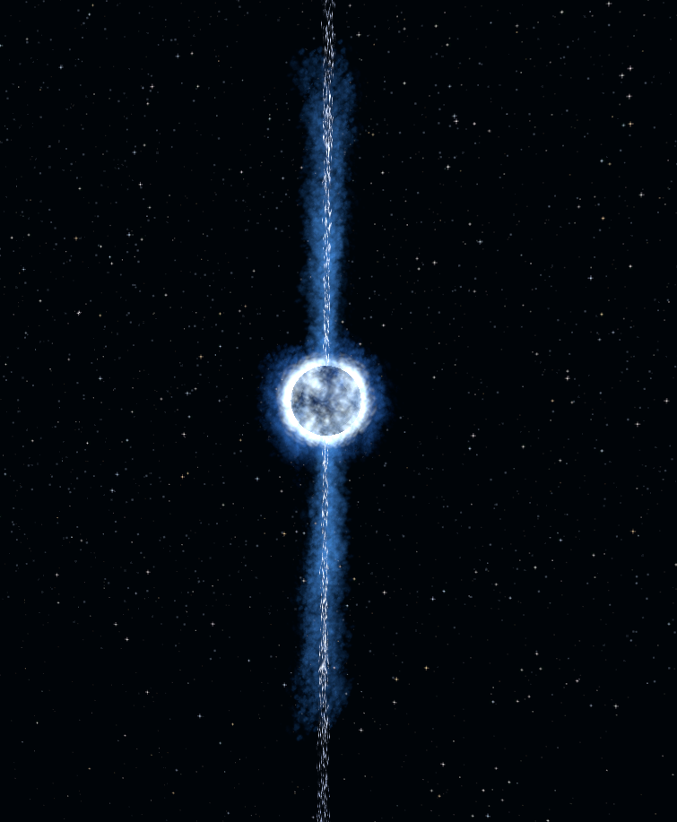
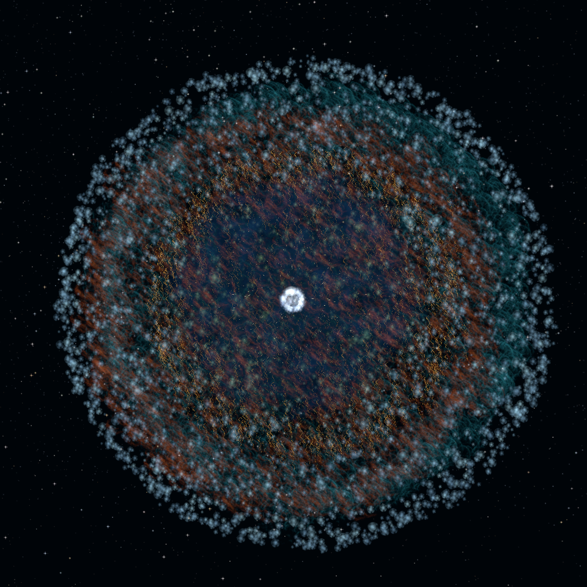
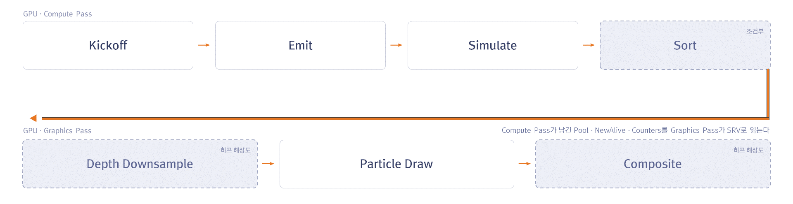

# GPU-Driven Particle System

DirectX 12 기반 GPU 파티클 시스템입니다. 이미터당 파티클 풀은 최대 100만 개입니다.

방출부터 드로우까지 GPU에서 처리하며,
**실행할 개수도 GPU가 정하기 때문에 CPU는 살아있는 파티클 수를 알 필요가 없습니다.**

`C++17` `DirectX 12` `HLSL` `Compute Shader` `ExecuteIndirect` `Bitonic Sort` `Signed Distance Field`

| | |
|---|---|
|  |  |
| `Asteroid Belt` | `Comet` |
|  |  |
| `Nebula` | `Protostar` |
|  |  |
| `Pulsar` | `Supernova Remnant` |

각 이미지는 천체 구성 요소를 파티클로 연출한 모습입니다.

## 주요 기능

- **Renderer 3종** - 스프라이트, 메시, 리본
- **GPU 정렬** - 반투명과 리본 파티클에 Bitonic Sort 적용
- **SDF Collision** - Signed Distance Field로 Bake된 메시와 충돌 처리
- **Forces** - Gravity, Curl Noise, SDF 기반 표면 회피 / 접선 / 인력
- **Mesh Morphing** - 표면을 샘플링해 목표 형상으로 끌어당김
- **Half Resolution 합성** - 파티클만 절반 해상도에 그린 뒤 씬에 합성
- **편의 기능** - ImGui 패널로 파티클 파라미터 편집 / JSON 씬 저장 및 로드

## 파이프라인

| 단계 | 하는 일 |
|---|---|
| Kickoff | 방출량을 정하고 이후 패스의 실행 인자를 기록 |
| Emit | DeadList에서 인덱스를 꺼내 새 파티클 초기화 |
| Simulate | 힘과 충돌 적용, 수명이 끝난 인덱스는 DeadList로 반납 |
| Sort | 반투명과 리본 파티클의 AliveList를 정렬 |
| Depth Downsample | 씬 깊이를 절반 해상도로 축소 |
| Particle Draw | Pool과 AliveList를 읽어 인스턴싱 |
| Composite | 절반 해상도 결과를 씬에 합성 |

## 빌드 및 실행

Visual Studio 2022 (v143, C++17), Windows SDK 10, DirectX 12와 셰이더 모델 6.2를 지원하는 GPU가 필요합니다. 

`GPU-Driven Particle.sln`을 열고 빌드하면 NuGet 패키지가 자동 복원됩니다.

실행하면 `Scenes/Showcase.json`이 로드됩니다.

| 입력 | 동작 |
|---|---|
| 마우스 우클릭 (누른 채로) | 시점 회전 |
| W / S / A / D | 전후 / 좌우 이동 |
| Q / E | 하강 / 상승 |
| 마우스 휠 (우클릭 중) | 이동 속도 조절 |

`Scenes/` 폴더의 JSON을 패널에서 불러올 수 있습니다. 

`Showcase`가 통합 데모, `MorphShowcase`가 모핑 씬 입니다.

## 라이선스

- MIT - [LICENSE](LICENSE)
- 번들된 외부 에셋 - [ASSETS.md](ASSETS.md)

`Framework/`는 Microsoft의 MiniEngine에서 필요한 부분만 추려 구성했습니다.
